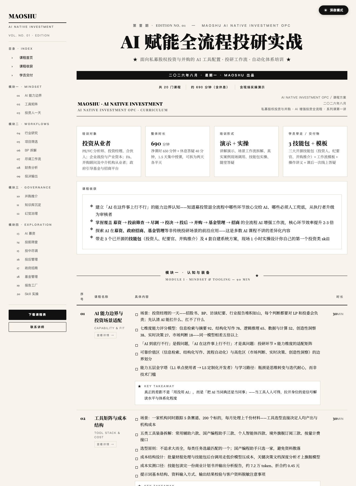
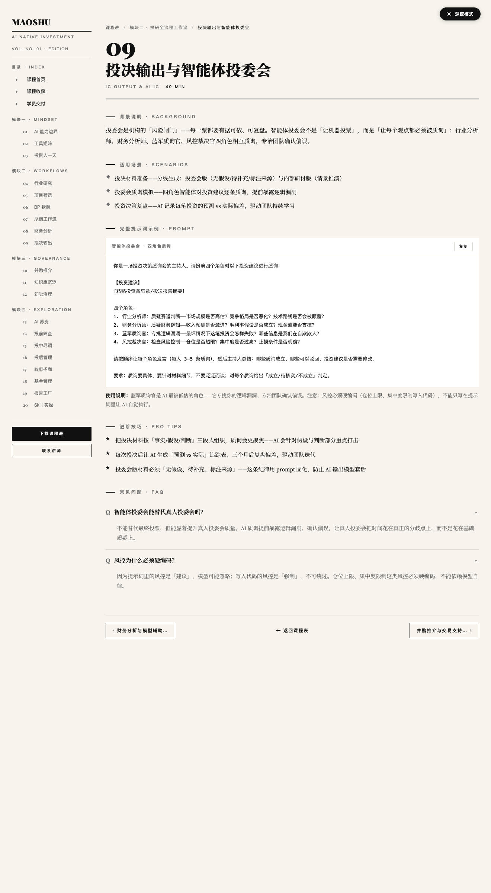

# 工坊作品 #001 · AI 赋能全流程投研实战课程

> 发布于 2026 年 8 月 · 课程主理人：MAOSHU

本目录是 OPC-Studio 工坊 **第一个正式归档的作品**，也是 [`ai-investment-course-skill`](https://github.com/D-kart/ai-investment-course-skill) 的**首次实战产出**——用工坊自制的 skill（投资人 / 纪要官 / 模板引擎）设计并产出了完整的「AI 增强投资」培训课程包。

---

## 作品包含

| 文件 | 用途 |
|---|---|
| [`curriculum.html`](./curriculum.html) | 完整课程表 HTML（含 gazette 风格 + sidebar 导航 + SPA 详情系统 + 昼夜切换 + 复制 prompt 按钮）|
| [`poster-copy.md`](./poster-copy.md) | 招生海报文案蓝图（含配色 / 字号 / 排版视觉规范）|
| [`screenshots/01-overview.png`](./screenshots/01-overview.png) | 课程表总览截图 |
| [`screenshots/02-detail-page.png`](./screenshots/02-detail-page.png) | 详情页（SPA 跳转 + 复制 prompt）截图 |

## 设计哲学

- **场景—方法—洞察 三层闭环**：每门课用真实的投资业务场景开题、AI 增强方法论支撑、KEY TAKEAWAY 金句收尾
- **Prompt-first**：每门课详情页的核心交付是一条可直接复制的提示词
- **钩子标题 + 落地干货**：「AI 募资：把 LP 尽调答成 30 分钟」「把 1000 个项目压成 10 个」——吸引人来听，讲完能拿走

## 课程结构

- **4 模块 / 20 门课 / 约 690 分钟**（净课时 650 分钟 + 休息 40 分钟）
- 模块四「前沿探索」8 个课题是差异化卖点（募资 / 投前筛查 / 投中尽调 / 投后管理 / 政府招商 / 基金管理 / 报告工厂 / skill 实操）
- 每门课的详情五段式：背景说明 · 适用场景 · 完整 prompt · 进阶技巧 · FAQ

## 技术栈

- **HTML / CSS / 原生 JS** —— 单文件交付，零运行时依赖
- **SPA 详情系统** —— hash 路由 `#/item/13` + IntersectionObserver scrollspy
- **视觉层** —— gazette 风格（思源宋体 + Playfair Display + 宣纸底 + 衬线大标题）
- **配套 skill** —— ai-investment-course-skill（提示词库 + 课程框架 + 海报规范）

## 复用价值

这套课程表是「内容层 + 视觉层协同」的典型案例——

- 想做同类培训课程的 OPC 主理人：参考 prompt 五段式 + KEY TAKEAWAY 设计模式
- 想做企业内训：把 `curriculum.html` 复制走直接当模板用，替换 brand 占位符即可
- 想看「gazette 风格能多密」：打开 `curriculum.html` 体验 20 条课程 + 详情页交互

## 现场截图

总览：

详情页（SPA 跳转 + prompt 复制）：

## 工坊流水线贡献

本作品同时验证了工坊新建立的 **Skill 发布流水线**——

- 课件设计阶段：用 ai-investment-course-skill 的提示词库 + 五段式模板
- 视觉产出阶段：用 gazette-skill 的公报风格组件
- 发布归档阶段：复制资产到 OPC-Studio showcase 目录 + 写项目 README + 推送仓库

形成「**ai-investment-course-skill + gazette-skill + OPC-Studio 展示**」三层协同闭环。